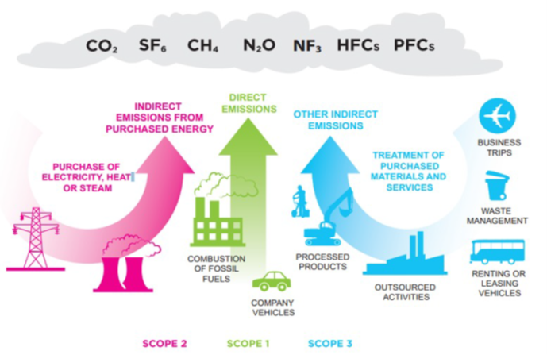
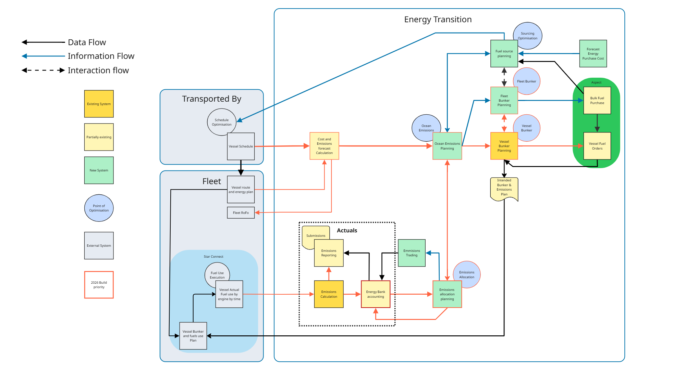

<!-- install basictex & pandoc with brew -->
<!-- pandoc gkinis_konstantinos.md -o gkinis_konstantinos.pdf --from markdown+pandoc_title_block --pdf-engine=xelatex -->

\pagebreak

Ο Πάγκος Εργασίας Εκπομπών (Emissions Workbench) είναι ένα σύστημα λογισμικού της Mærsk με στόχο τη διευκόλυνση της επίτευξης του στόχου της εταιρείας για καθαρές μηδενικές εκπομπές το 2040 (net zero 2040). Ξεκίνησε την ανάπτυξή του το Μάρτιο του 2023 και απέκτησε τους πρώτους χρήστες το Σεπτέμβριο του ίδιου έτους.

# Η ανάγκη δημιουργίας του Πάγκου Εργασίας Εκπομπών

Αναμένεται σύντομα, κάθε εταιρεία εντός Ευρωπαϊκής Ένωσης να υποχρεωθεί να δηλώνει τις εκπομπές διοξειδίου του άνθρακα (CO~2~ από δω και πέρα) που προκύπτουν απ' τη διεξαγωγή των επιχειρηματικών ενεργειών της.

Συγκεκριμένα η διαχειρίστρια εταιρεία της Mærsk (holding group), έχει δείξει έμπρακτα με μεγάλο μέρος επενδύσεων, πως έχει ως προτεραιότητα τη μείωση της επιρροής στο περιβάλλον από τις επιχηριματικές της δραστηριότητες. Κατ' επέκταση έχει θέσει ως στόχο την επίτευξη καθαρών μηδενικών εκπομπών μέχρι το 2040 (αυτό συνεπάγεται ότι ο κύκλος του άνθρακα που συσχετίζεται με τις δραστηριότητες της εταιρείας, θα έχει μηδενικό ισοζύγιο, δηλαδή δεν θα προστίθεται CO~2~ στην ατμόσφαιρα).

Για την επίτευξη αυτών των στόχων, είναι προφανώς απαραίτητη η δυνατότητα μέτρησης των εκπομπών CO~2~ από την εταιρεία. Η μέτρηση αυτή πρέπει να είναι όσο το δυνατόν κοντινότερη στην πραγματικότητα, αλλά και απολύτως πλήρης, περιλαμβάνοντας όλες τις εκπομπές, άμεσες ή έμμεσες.

Επιπροσθέτως, η Mærsk δηλώνει και ελέγχεται από ανεξάρτητη αρχή για τις ετήσιες εκπομπές CO~2~. Για τη διευκόλυνση αυτού του ελέγχου, και τη διευθέτηση τυχόν ζητημάτων, απαιτείται όσο το δυνατόν μεγαλύτερη διαφάνεια και ελαχιστοποίηση ανθρώπνινων σφαλμάτων.

## Μέτρηση εκπομπών CO~2~

Οι περισσότερες μεγάλες εταιρείες διέπονται από το GHG Protocol (greenhouse gas protocol - προτόκωλο εκπομπών αερίων θερμοκηπίου) σχετικά με τη μέτρηση των εκπομπών τους. Το προτόκωλο αυτό ξεκίνησε να χρησιμοποιείται από το 2001 και αφορά όλα τα σχετικά αέρια θερμοκηπίου που σημειώνονται στη συνθήκη του Κυότο (1997).

Οι εκπομπές CO~2~ χωρίζονται συνήθως σε 3 κατηγορίες:

* Κατηγορία 1: Απ' ευθείας εκπομπές από πηγές που ανήκουν σε έναν οργανισμό (πχ καύσιμα για κίνηση πλοίων ή φορτηγών)
* Κατηγορία 2: Έμμεσες εκπομπές από την παραγωγή και προμήθεια / μεταφορά της ενέργειας που καταναλώνει ένας οργανισμός (πχ εκπομπές από εργοστάσιο ενέργειας που ηλεκτροδοτεί τα γραφεία της εταιρείας ή μια πύλη/terminal φορτοεκφόρτωσης λιμανιού)
* Κατηγορία 3: Εκπομπές από μέσα παραγωγής που δεν ανήκουν απ' ευθείας στον οργανισμό, αλλά είναι εμμέσως υπεύθυνος για τη χρήση τους. Επιπλέον, περιλαμβάνει οποιεσδήποτε εκπομπές δεν υποπίπτουν στις κατηγορίες 1 και 2. (πχ ενοικιασμένα ρυμουλκά πλοία ή εκπομπές που συσχετίζονται με προϊόντα που αγοράζει η εταιρεία)

### Μεθοδολογία μετρήσεων με βάση το κόστος

Η μεθοδολογία αυτή στηρίζεται στην οικονομική αξία των καυσίμων, πολλαπλασιασμένη από ορισμένους παράγοντες εκπομπών. Στηρίζεται σε μέσο όρο εκπομπών για την εκάστοτε βιομηχανία, που προκύπτει από διεθνή δεδομένα. Είναι η απλούστερη μέθοδος, ωστόσο οδηγεί σε απώλεια ακρίβειας.

### Μεθοδολογία με βάση τη δραστηριότητα

Η συγκεκριμένη μεθοδολογία συλλέγει όσο περισσότερα δεδομένα είναι δυνατό, σε όλη την κατακόρυφη αλυσίδα μιας εταιρείας. Στηρίζεται στην καταγραφή αναλυτικών δεδομένων για κάθε δράση της εταιρείας. Αυτό παρέχει τη μέγιστη δυνατή ακρίβεια, αλλά συνεπάγεται και πολύ μεγαλύτερης πολυπλοκότητας στην υλοποίηση.

### Υβριδική μεθοδολογία

Η υβριδική μεθοδολογία προτείνεται και από το GHGP συνδυάζοντας τις δύο προαναφερθείς μεθοδολογίες. Αφενός συλλέγονται όσο περισσότερα δεδομένα είναι εφικτό, αφετέρου τα κενά συμπληρώνονται με τις εκτημίσεις βάση κόστους. Αποτελεί μια ισορροπημένη απάντηση στο πρόβλημα που καλύπτει τυχόν κενά δεδομένων, με τη μικρότερη δυνατή απώλεια ακρίβειας. Αυτή είναι και η μεθοδολογία που επιλέχθηκε να υλοποιηθεί από την πλατφόρμα λογισμικού που περιγράφεται.

## Η προηγούμενη διαδικασία και τα μειονεκτήματά της

Πριν τη δημιουργία του λογισμικού του Πάγκου Εργασίας, οποιαδήποτε πληροφοριακή ανάγκη σχετική με εκπομπές CO~2~ ήταν μια χρονοβόρα, χειροκίνητη διαδικασία. Δεδομένα από διαφορετικές πηγές, όπως βάσεις δεδομένων και εξειδικευμένα πληροφοριακά συστήματα, συλλέγονταν και κανονικοποιούνταν από κάποιον data analyst. Η κανονικοποίηση (πχ η ίδια τοποθεσία μπορούσε να είναι γραμμένη με διαφορετικό τρόπο σε δύο βάσεις δεδομένων) γινόταν επίσης με το χέρι, κάτι που μπορούσε να οδηγήσει σε λάθη. Τα δεδομένα αυτά εξάγονταν σε αρχεία Excel και δίνονταν για επεξεργασία στο τμήμα υπεύθυνο για τη μεθοδολογία μετρήσεων εκπομπών CO~2~. Τελικά έφταναν (μετά από βδομάδες ή μήνες) στον αρχικό αιτούντα.

Αυτή η διαδικασία, εκτός απ' τα πολλά σημεία στα οποία επέτρεπε ανθρώπινο σφάλμα, ήταν εντελώς ακατάλληλη για κοινοποίηση στις ελεγκτικές αρχές. Τα δεδομένα μπορεί να είχαν αλλάξει αρκετά απ' τη στιγμή που συλλέχθηκαν μέχρι την ολοκλήρωση των υπολογισμών. Επίσης ήταν αδύνατο να εγγυηθεί κανείς πως η μεθοδολογία υπολογισμών ακολουθήθηκε ακριβώς, καθώς ήταν ένας χειρικίνητος υπολογισμός στο Excel. Τέλος, αν η εκάστοτε αρχή ήθελε να επαναλάβει κάποιον υπολογισμό για το περασμένο έτος, μπορεί τα δεδομένα να είχαν χαθεί (να είχαν αντικατασταθεί με πιο πρόσφατα).

## Το λογισμικό μιας ολοκληρωμένης λύσης

Η λύση που σχεδιάστηκε και υλοποιήθηκε, αντιμετώπισε όλα τα προαναφερθέντα προβλήματα, και επέτρεψε δυνατότητες που λειτουργούν ως ανταγωνιστικό πλεονέκτημα της εταιρείας, έναντι ανταγωνιστών.

Το λογισμικό παρουσιάζεται στο χρήστη (υπάλληλοι της εταιρείας μόνο), μέσω μιας ιστοσελίδας. Εκεί ανά πάσα στιγμή υπάρχουν τα νεότερα δεδομένα που έχουμε στη διάθεσή μας, και ασύγχρονα ενημερώνεται η σελίδα ακόμα και αν είναι ήδη ανοιχτή χωρίς να χρειάζεται ανανέωση.

Όλες οι δυνατές πηγές δεδομένων (βάσεις, ροές, εξωτερικά APIs) συγκεντρώνονται και κανονικοποιούνται σε ένα σύστημα, το οποίο εκτελεί τους υπολογισμούς εκπομπών σύμφωνα με την καθορισμένη μεθοδολογία. Η συγκέντρωση της πληροφορίας, επιτρέπει επίσης την δημιουργία καταγραφών αλλαγής των δεδομένων μέσα στο χρόνο, με αποτέλεσμα τη δυνατότητα να μπορούμε ανά πάσα στιγμή να δώσουμε τόσο τα πηγαία δεδομένα, όσο και την τότε μεθοδολογία υπολογισμού στις ελεγκτικές αρχές, ώστε να μπορούν να διασταυρώσουν τα αποτελέσματά μας.

Η συνεχής ανανέωση των δεδομένων, διευκολύνει επίσης τις πωλήσεις "οικολογικών προϊόντων" (ECO Products), που αφορούν τρόπους αποστολής εμπορευμάτων με εναλλακτικά καύσιμα, με μειωμένες εκπομπές ρύπων. Συγκεκριμένα, ανά πάσα στιγμή, ένας πωλητής μπορεί να γνωρίζει τι διαθεσιμότητα υπάρχει για κάθε εναλλακτικό καύσιμο, ποιά είναι η τρέχουσα τιμή του, κτλ ώστε να το χρεώσει αντίστοιχα.

Επιπροσθέτως, δίνεται η δυνατότητα στην εταιρεία να πουλάει "εικονικά" χαμηλότερες εκπομπές CO~2~, με αποδείξιμο τρόπο ότι αυτές συνέβησαν. Για παράδειγμα, μπορεί ένας πελάτης που θέλει να μειώσει τις εκπομπές του, να πληρώσει επιπλέον ώστε να χρησιμοποιηθεί κάποιο εναλλακτικό καύσιμο. Ωστόσο, μπορεί να μην αλλάξει τίποτα στη μεταφορά των εμπορευμάτων του. Παράλληλα όμως, μπορεί ένα άλλο φορτίο σε διαδρομή που θα οδηγούσε στην ίση κατανάλωση ενέργειας, να σταλεί με εναλλακτικά καύσιμα (χωρίς να έχει πληρώσει γι' αυτό ο ιδιοκτήτης του), και έτσι να ισοζυγιστεί από εκεί η συνολική εκπομπή CO~2~. Αυτό τώρα μπορεί να είναι αποδείξιμα σωστό, καθώς το σύστημα συγκεντρώνει όλη τη χρήση καυσίμων της εταιρείας, καθώς και τα αποδεικτικά για την προμήθεια και κατανάλωση αυτών των καυσίμων (συνεπώς μπορεί να αποδειχθεί ότι συνολικά καταναλώθηκαν τα ζητούμενα kg εναλλακτικού καυσίμου, ακόμα κι αν ήταν σε διαφορετικό φορτίο).

Τέλος, ένα μεγάλο ανταγωνιστικό πλεονέκτημα αφορά την έκδοση πιστοποιητικών. Μιας και η διαδικασία είναι πλήρως ελέγξιμη, είναι δυνατό να εκδοθούν πιστοποιητικά για τις εκπομπές κάποιου πελάτη για τις συναλλαγές του με την εταιρεία. Αυτά τα πιστοποιητικά μπορούν να αποσταλούν στις αντίστοιχες αρχές, οι οποίες μπορούν να τα επιβεβαιώσουν μετέπειτα. Επίσης η έκδοση ή ανανέωση/επανέκδοση ενός πιστοποιητικού μπορεί να γίνει αυτόματα (αν πχ μετά από μερικούς μήνες έχει αλλάξει σημαντικά κάποια τιμή).

## Περιορισμοί

Αυτή τη στιγμή περιλαμβάνονται μόνο μετρήσεις κατηγορίας 1 και 3. Οι μετρήσεις κατηγορίας 2 θα υλοποιηθούν μέσα στο 2025.

\pagebreak

# Βελτιστοποίηση Αλυσίδας Εφοδιασμού και Συνδυασμός Καυσίμων

Η δεύτερη πυλώνα του Πάγκου Εργασίας Εκπομπών είναι η βελτιστοποίηση της αλυσίδας εφοδιασμού καυσίμων και η διαχείριση εναλλακτικών καυσίμων μέσω ενός συστήματος ενεργειακής τραπέζης (Energy Bank). Αυτό το σύστημα επιτρέπει στη Mærsk να παρακολουθεί, να ελέγχει και να βελτιστοποιεί την ανάμειξη των καυσίμων που χρησιμοποιεί στη ναυτιλία, ενώ συγχρόνως προσφέρει νέες δυνατότητες πωλήσεων μέσω των ECO Products.

## 2.1 Σύγχρονες τάσεις στη ναυτιλία και τα εναλλακτικά καύσιμα

Ο τομέας της ναυτιλίας αντιμετωπίζει αυξανόμενες πιέσεις για την μείωση των εκπομπών άνθρακα. Οι σύγχρονες τάσεις περιλαμβάνουν:

**Κανονιστικές Απαιτήσεις**: Οι διεθνείς κανονισμοί, όπως ο EU-MRV (Monitoring, Reporting and Verification) και ο CBAM (Carbon Border Adjustment Mechanism), απαιτούν αυξημένη διαφάνεια και ακρίβεια στις μετρήσεις εκπομπών. Παράλληλα, νέοι κώδικες όπως ο IMO 2030 και IMO 2050 θέτουν δεσμευτικούς στόχους για τη μείωση της CO~2~ εντάσεως της ναυτιλίας.

**Εναλλακτικά Καύσιμα**: Η αγορά δοκιμάζει διάφορα εναλλακτικά καύσιμα, συμπεριλαμβανομένων του μεθανόλου, των βιοκαυσίμων (biofuels), και του αμμωνίας. Κάθε ένα από αυτά τα καύσιμα έχει διαφορετικές περιβαλλοντικές επιπτώσεις, κόστη και λογιστικές επιπτώσεις που πρέπει να αποτιμηθούν με ακρίβεια.

**Sustainability Certifications**: Για να ληφθούν τα κ-credits και άλλα περιβαλλοντικά κίνητρα, τα εναλλακτικά καύσιμα πρέπει να συνοδεύονται από πιστοποιητικά βιωσιμότητας. Το σύστημα CEEMAS (Comprehensive Emissions Accounting and Management System) και άλλα πρότυπα παρέχουν αποδείξεις της προέλευσης και των περιβαλλοντικών ιδιοτήτων των καυσίμων.

**Δυναμική Τιμολόγηση**: Καθώς η ζήτηση για πράσινα καύσιμα αυξάνεται, η τιμολόγηση τους γίνεται πολύ πιο δυναμική και εξαρτημένη από παράγοντες όπως η διαθεσιμότητα, η εποχικότητα, και τα γεωγραφικά σημεία (ports of call).

## 2.2 Εισαγωγή στην Ενεργειακή Τράπεζα (Energy Bank)

Η Ενεργειακή Τράπεζα είναι το κεντρικό σύστημα που διαχειρίζεται τα ενεργειακά αποθέματα της Mærsk σε επίπεδο σκάφους. Λειτουργεί ως ένας εικονικός λογαριασμός που ταξιδεύει με κάθε πλοίο, καταγράφοντας όλες τις καταθέσεις και αναλήψεις καυσίμου.

**Θεμελιώδης Λογική**: Η Ενεργειακή Τράπεζα βασίζεται στην αρχή του ισοζυγίου: κάθε μονάδα ενέργειας που καταναλώνεται από ένα πλοίο πρέπει να έχει καταχωρηθεί ως πηγή πριν από τη χρήση της. Αυτό δημιουργεί μια σχέση ένα-προς-ένα μεταξύ της ποσότητας και του τύπου του καυσίμου που χρησιμοποιείται, και της πληροφορίας σχετικά με τις εκπομπές και την προέλευσή του.

**Κύρια Σύνθετα**: Η Ενεργειακή Τράπεζα αποτελείται από δύο κύρια σύνθετα:
- **Deposits (Καταθέσεις)**: Καταγραφή της εισόδου καυσίμου (bunkering operations), όπου μια ποσότητα καυσίμου προστίθεται στον λογαριασμό ενέργειας του πλοίου.
- **Withdrawals (Αναλήψεις)**: Καταγραφή της κατανάλωσης καυσίμου κατά τη διάρκεια της ναυσιπλοΐας και της παράδοσης εμπορευμάτων, όπου ποσότητες ενέργειας αφαιρούνται από τον λογαριασμό.

**Σκοπός**: Η Ενεργειακή Τράπεζα επιτρέπει:
- Ακριβή παρακολούθηση της σύνθεσης των καυσίμων που χρησιμοποιούνται
- Αποδείξιμη αντιστοίχιση καταναλώσεως με περιβαλλοντικές δηλώσεις
- Ευελιξία στη διαχείριση της μίξης καυσίμων για τη μεγιστοποίηση των πράσινων πιστώσεων
- Βάση για δυναμική τιμολόγηση ECO Products

## 2.3 Κύκλος ζωής αποθήκευσης και κατανάλωσης καυσίμων

### 2.3.1 Φάση Κατάθεσης Καυσίμου

Όταν ένα πλοίο προμηθευτεί (bunker) καύσιμο σε ένα λιμάνι, αρχίζει μια τριφασική διαδικασία:

**Στάδιο 1: Προκαταρκτική Κατάθεση (Preliminary Deposit)**

Τη στιγμή που η παράδοση καυσίμου (fuel delivery) επιβεβαιώνεται από το σύστημα Shiptech:
- Η ποσότητα του καυσίμου (μετρούμενη σε τόνους ή κυβικά μέτρα) μετατρέπεται σε ενεργειακές μονάδες (συνήθως σε κιλοβατώρες ή τόνους ίσοδύναμου CO~2~)
- Το ενεργειακό περιεχόμενο υπολογίζεται χρησιμοποιώντας παράγοντες που εξαρτώνται από τον τύπο του καυσίμου (VLSFO, Marine Gas Oil, methanol, κ.ά.)
- Η κατάθεση καταγράφεται ως **προκαταρκτική**, δηλαδή δεν είναι ακόμη πλήρως πιστοποιημένη

Κατά αυτό το στάδιο, ο υπολογισμός της ενέργειας βασίζεται σε τυπικές τιμές και δεδομένα από πηγές όπως τα Shiptech records, χωρίς ακόμα πληροφορίες σχετικά με τη βιωσιμότητα του καυσίμου.

**Στάδιο 2: Πιστοποίηση Βιωσιμότητας (Sustainability Certification)**

Αργότερα, όταν λαμβάνεται το πιστοποιητικό βιωσιμότητας (Proof of Sustainability, ή PoS) από το σύστημα CEEMAS ή άλλες αρχές:
- Ο υπολογισμός της ενέργειας ενδέχεται να αναθεωρηθεί, χρησιμοποιώντας λεπτομερέστερα δεδομένα σχετικά με την πραγματική βιωσιμότητα του καυσίμου
- Η κατάθεση αμέσως **πιστοποιείται** ως ακριβής και αποδείξιμη
- Αυτό το στάδιο είναι κρίσιμο για τη δυνατότητα της εταιρείας να δηλώσει τις εκπομπές με ακρίβεια στις ελεγκτικές αρχές

Για παράδειγμα, αν ένα καύσιμο δηλώνεται ως "κατωτέρω" (low-carbon methanol), τα πιστοποιητικά βιωσιμότητας αποδεικνύουν ότι η παραγωγή του εξέλιπε χαμηλότερες εκπομπές από τα ορυκτά ανάλογα.

**Στάδιο 3: Άνοιγμα Υπολοίπου (Opening Balance)**

Σε ορισμένες περιπτώσεις, ειδικά στην αρχή ενός λογιστικού έτους, μπορεί να οριστεί ένα "άνοιγμα υπολοίπου" που αντιπροσωπεύει το υπόλοιπο καύσιμο του προηγούμενου έτους ή άλλα ενεργειακά στοιχεία που πρέπει να λογαριαστούν.

### 2.3.2 Φάση Κατανάλωσης και Αναλήψεων

Κατά τη διάρκεια της ναυσιπλοΐας, καθώς το πλοίο διαδίδει εμπορεύματα (containers) και καταναλώνει καύσιμο:

**Κατάλογος Φορτίου (Container Shipment Loading)**

Όταν ένα container φορτώνεται για πρώτη φορά στο πλοίο:
- Υπολογίζεται η ενέργεια που θα καταναλωθεί για τη μεταφορά του συγκεκριμένου φορτίου (με βάση παράγοντες όπως η απόσταση, το μέγεθος του container, οι συνθήκες της θάλασσας)
- Αυτή η ποσότητα αφαιρείται από την Ενεργειακή Τράπεζα ως **ανάληψη**
- Σε αυτό το σημείο, καθορίζεται ποιος τύπος καυσίμου (ή ανάμειξη καυσίμων) θα χρησιμοποιηθεί για αυτό το φορτίο

**Διόρθωση Φορτίου (Container Shipment Correction)**

Εάν υπάρχουν αλλαγές στην απόσταση, το βάρος, ή άλλες παράμετροι του φορτίου:
- Ο υπολογισμός της ενέργειας διορθώνεται
- Η ανάληψη από την Ενεργειακή Τράπεζα προσαρμόζεται ανάλογα
- Αυτό διασφαλίζει ότι το ισοζύγιο παραμένει ακριβές

**Ακύρωση Φορτίου (Container Shipment Cancellation)**

Εάν ένα φορτίο δεν αποστέλλεται τελικά:
- Η ανάληψη που είχε καταχωρηθεί για αυτό το φορτίο αφαιρείται
- Η ενέργεια επιστρέφεται στην Ενεργειακή Τράπεζα
- Αν η ακύρωση αργότερα ανακληθεί, η ανάληψη επαναφέρεται

### 2.3.3 Σχέση Καταθέσεων και Αναλήψεων

Η κύρια αρχή της Ενεργειακής Τράπεζας είναι ότι **οι αναλήψεις πρέπει να ταιριάζουν με τις καταθέσεις**. Αυτό σημαίνει:

- **Ολική Ενέργεια**: Σε οποιαδήποτε στιγμή, το σύνολο της ενέργειας που έχει καταναλωθεί (withdrawals) δεν μπορεί να υπερβαίνει την ενέργεια που έχει καταχωρηθεί (deposits).
- **Αμφίδρομη Αναμόρφωση**: Εάν η ενέργεια των αναλήψεων αλλάζει (π.χ. λόγω διόρθωσης), το ισοζύγιο της Τράπεζας αναμορφώνεται αντίστοιχα.
- **Ιστορικότητα**: Όλες οι αλλαγές καταγράφονται ιστορικά, ώστε να μπορούν ανά πάσα στιγμή να επαναληφθούν και να αναφερθούν στις ελεγκτικές αρχές.

## 2.4 Σύστημα ECO Products Surcharges

Ένα σημαντικό πλεονέκτημα που παρέχει η Ενεργειακή Τράπεζα είναι η ικανότητα να προσφέρουν τα λεγόμενα "ECO Products" - προϊόντα με μειωμένες εκπομπές που πωλούνται σε πελάτες με ένα επιπλέον κόστος (surcharge).

### 2.4.1 Δυναμική Τιμολόγηση

Σε κάθε στιγμή, ο Πάγκος Εργασίας Εκπομπών γνωρίζει:
- Ποια καύσιμα είναι διαθέσιμα και σε ποια ποσότητα
- Ποια είναι η τρέχουσα τιμή κάθε καυσίμου στην αγορά
- Ποιες διαδρομές χρησιμοποιούν ποιο καύσιμο
- Ποια είναι η διαφορά κόστους μεταξύ παραδοσιακών και πράσινων καυσίμων

Με αυτές τις πληροφορίες, οι πωλητές μπορούν να υπολογίσουν **δυναμικά** το επιπλέον κόστος που πρέπει να χρεώσουν όταν ένας πελάτης επιλέγει να πληρώσει για την χρήση εναλλακτικών καυσίμων.

### 2.4.2 Υπολογισμός του Surcharge

Ο υπολογισμός του surcharge βασίζεται στην ακόλουθη λογική:

**1. Κόστος Αποφυγής Εκπομπών (Abatement Cost)**

Αρχικά, υπολογίζεται ποιο είναι το κόστος για τη Mærsk να χρησιμοποιήσει ένα πράσινο καύσιμο αντί ενός παραδοσιακού:

$$Abatement\ Cost = \frac{Green\ Fuel\ Price - VLSFO\ Price}{Grey\ Fuel\ WtW \times \frac{Savings\ \%}{100}}$$

Όπου:
- **Green Fuel Price**: Η τιμή αγοράς του πράσινου καυσίμου (π.χ. methanol)
- **VLSFO Price**: Η τιμή του συμβατικού καυσίμου (Very Low Sulphur Fuel Oil)
- **Grey Fuel WtW**: Το περιεχόμενο CO~2~ του συμβατικού καυσίμου (Well-to-Wake)
- **Savings %**: Το ποσοστό μείωσης εκπομπών που επιτυγχάνεται με το πράσινο καύσιμο

**2. Surcharge για τον Πελάτη**

Όταν ένας πελάτης επιλέγει να πληρώσει για χαμηλότερες εκπομπές, το surcharge υπολογίζεται ως:

$$Surcharge = Grey\ Fuel\ Used \times Green\ Fuel\ Price$$

Αυτή η φόρμουλα απλοποιείται από την αρχική:
$$Surcharge = (Grey\ Fuel\ Used \times (Green\ Fuel\ Price - VLSFO\ Price)) + (Grey\ Fuel\ Used \times VLSFO\ Price)$$

Η απλοποίηση γίνεται επειδή:
- $(Green\ Fuel\ Price - VLSFO\ Price)$ + $VLSFO\ Price$ = $Green\ Fuel\ Price$

Επομένως, το τελικό κόστος είναι απλά το ποσό του καυσίμου που θα καταναλώνονταν πολλαπλασιασμένο επί την τιμή του πράσινου καυσίμου.

### 2.4.3 Πρακτική Εφαρμογή

Ένα παράδειγμα εφαρμογής:

Έστω ότι ένας πελάτης θέλει να στείλει ένα container από τη Σαγκάη στο Ρότερνταμ, και η Mærsk γνωρίζει ότι:
- Το φορτίο θα χρησιμοποιήσει 8 τόνους συμβατικού καυσίμου (VLSFO)
- Η τιμή του VLSFO είναι 600 €/τόνο
- Η τιμή του πράσινου methanol είναι 1000 €/τόνο
- Ο methanol έχει 40% χαμηλότερες εκπομπές

Το κόστος χρήσης του methanol για αυτό το φορτίο θα ήταν:
$$Surcharge = 8\ tonnes \times 1000\ €/tonne = 8000\ €$$

Χωρίς το ECO Product, το κόστος κανονικής παράδοσης θα ήταν:
$$Normal\ Cost = 8\ tonnes \times 600\ €/tonne = 4800\ €$$

Το πρόσθετο κόστος που πληρώνει ο πελάτης για τις χαμηλότερες εκπομπές είναι:
$$ECO\ Surcharge = 8000\ € - 4800\ € = 3200\ €$$

## 2.5 Ολοκλήρωση με τη Διαχείριση Αποθεμάτων

### 2.5.1 Συνδυασμός Καυσίμων (Fuel Blending)

Μια από τις πιο ισχυρές δυνατότητες της Ενεργειακής Τράπεζας είναι η ικανότητα να διαχειρίζεται ανάμειξη καυσίμων (fuel blending). Δεν είναι απαραίτητο όλο το καύσιμο που χρησιμοποιείται σε ένα κάνα φορτίο να είναι του ίδιου τύπου.

Για παράδειγμα, ένα πλοίο μπορεί να έχει τη δυνατότητα να χρησιμοποιήσει:
- 60% VLSFO (συμβατικό)
- 30% Πράσινο Methanol (σε χαμηλή πραγματική κατανάλωση, ίσως επειδή είναι ακριβό)
- 10% Βιοκαύσιμα (biofuels)

Η Ενεργειακή Τράπεζα καταγράφει τη σύνθεση αυτή και επιτρέπει:
- **Ευελιξία**: Η ανάμειξη μπορεί να αλλάξει ανάλογα με τη διαθεσιμότητα και τις τιμές
- **Βελτιστοποίηση**: Η εταιρεία μπορεί να χρησιμοποιήσει προγνωστικά μοντέλα για να καθορίσει τη βέλτιστη μίξη για κάθε διαδρομή
- **Αποδοχιμότητα**: Κάθε ποσοστό της κατανάλωσης μπορεί να αποδοθεί σε συγκεκριμένα πιστοποιητικά βιωσιμότητας

### 2.5.2 Εικονικές Μεταφορές (Virtual Offsets)

Ίσως το πιο καινοτόμο χαρακτηριστικό του συστήματος είναι η δυνατότητα "εικονικών μεταφορών". Ο μηχανισμός λειτουργεί ως εξής:

**Σενάριο**: Ένας πελάτης θέλει να δηλώσει ότι ένα συγκεκριμένο φορτίο του είχε μηδενικές εκπομπές, ενώ στην πραγματικότητα χρησιμοποιήθηκε κανονικό καύσιμο.

**Μηχανισμός**:
1. Ο πελάτης πληρώνει ένα ECO Surcharge για το φορτίο του
2. Αυτά τα χρήματα χρησιμοποιούνται ώστε η Mærsk να χρησιμοποιήσει πράσινα καύσιμα σε **άλλο** φορτίο σε άλλη διαδρομή
3. Καθώς και τα δύο φορτία έχουν παρόμοιες ενεργειακές ανάγκες και όλες οι καταθέσεις / αναλήψεις καταγράφονται στη συνολική Ενεργειακή Τράπεζα, το σύστημα μπορεί να δηλώσει ότι ο συνολικός όγκος της περιβαλλοντικής επίδρασης ήταν μειωμένος

**Πλεονεκτήματα**:
- **Παγκόσμια Αναμόρφωση**: Δεν χρειάζεται το συγκεκριμένο φορτίο να χρησιμοποιήσει πράσινο καύσιμο. Αρκεί η συνολική εταιρεία να το χρησιμοποιήσει.
- **Αποδείξιμη Μέθοδος**: Γιατί όλες οι συναλλαγές καύσιμο καταγράφονται σε ένα κεντρικό σύστημα, οι ελεγκτικές αρχές μπορούν να επαληθεύσουν ότι σχετικά κιλά πράσινου καυσίμου χρησιμοποιήθηκαν πραγματικά.
- **Ανταγωνιστικό Πλεονέκτημα**: Η Mærsk μπορεί να προσφέρει "green shipping" σε πελάτες που δεν επιθυμούν ή δεν μπορούν να περιμένουν για συγκεκριμένο πράσινο καύσιμο σε συγκεκριμένη διαδρομή.

### 2.5.3 Πιστοποίηση και Αναφορά

Ένα τελικό στοιχείο της ολοκλήρωσης της Ενεργειακής Τράπεζας με τη διαχείριση αποθεμάτων είναι η πιστοποίηση και αναφορά:

**Πιστοποιητικά Πελατών**: Ο Πάγκος Εργασίας Εκπομπών μπορεί να εκδώσει πιστοποιητικά για κάθε πελάτη, δηλώνοντας:
- Το σύνολο των eκπομπών CO~2~ που σχετίζονται με τις αποστολές τους
- Πόσο μείωση εκπομπών επιτεύχθη μέσω ECO Products
- Τα συγκεκριμένα πιστοποιητικά βιωσιμότητας που υποστηρίζουν αυτές τις δηλώσεις

**Ορχήστρωση με τη Διαχείριση Αποθεμάτων**: Η Ενεργειακή Τράπεζα συνδέεται ρητά με τα συστήματα διαχείρισης αποθεμάτων (inventory management systems), ώστε:
- Κάθε αλλαγή στο απόθεμα καυσίμου ενός πλοίου αποτυπώνεται αμέσως
- Οι προβλέψεις για μελλοντικές καταθέσεις μπορούν να ληφθούν υπόψη κατά τη διαδικασία τιμολόγησης
- Οι περιορισμοί όσον αφορά τη δυνατότητα αποθήκευσης συγκεκριμένων τύπων καυσίμου (π.χ. λόγω συμβατότητας ή ασφάλειας) λαμβάνονται υπόψη

\pagebreak

# Τεχνολογία

Η φύση του προβλήματος ταιριάζει με φυσικό τρόπο στο νοητικό μοντέλο ενός συστήματος προμήθειας γεγονότων (event sourcing). Συγκεκριμένα, διάφορες πηγές, σύγχρονες (βάσεις δεδομένων ή APIs) ή ασύγχρονες (ουρές - queues ή ροές - data streams), περνούν από ένα pipeline (γραμμή αγωγών) δεδομένων, μετασχηματίζονται, και συλλέγονται. Όλη αυτή η επεξεργασία δεν έχει χρονικές εξαρτήσεις, συνεπώς μπορεί να παραλληλοποιηθεί πλήρως, άρα ένα σύστημα με εύκολη παραλληλία είναι επιθυμητό (horizontal scaling).

Σημαντική ανάγκη είναι η ανοχή σε σφάλματα. Μιας και το pipeline των δεδομένων έχει πολλά σημεία στα οποία μπορεί να στηριχθεί σε κλήσεις σε εξωτερικά συστήματα, η πιθανότητα για κάποιο αναπάντεχο σφάλμα εκτός του ελέγχου μας δεν πρέπει να οδηγεί σε κατάρρευση του δικού μας συστήματος ή καταστροφή δεδομένων.

## Επιλογή τεχνολογιών

Η κύρια τεχνολογία που επιλέχθηκε γιατί ακριβώς ταίριαζε στις παραπάνω ανάγκες είναι η virtual machine (εικονική μηχανή) BEAM και κατ' επέκταση οι γλώσσες προγραμματισμού που τρέχουν πάνω σ' αυτή.

Η virtual machine αυτή, δημιουργήθηκε από μηχανικούς της Ericsson για την εκτέλεση της γλώσσας Erlang. Προσφέρει φτηνή και εύκολη παραλληλία τόσο σε επίπεδο διεργασίας όσο και κατανεμημένου συστήματος και ανοχή στα σφάλματα. Συγκεκριμένα, επιλέχθηκε η γλώσσα προγραμματισμού Elixir, μιας και το συντακτικό της ήταν πιο εύκολο από της Erlang, ενώ έχει αρκετή ωριμότητα (πχ πλήθος πακέτων ανοιχτού κώδικα), καθώς και πρόσβαση στο Phoenix Framework.

Για την κατασκευή της ιστοσελίδας και της διεπαφής με το χρήστη, επιλέχθηκε το framework Phoenix (παρόμοιο με το framework Ruby on Rails σε φιλοσοφία). Επιλέχθηκε καθώς επιτρέπει γρήγορη δημιουργία νέων σελίδων, αλλά και την παραγωγή πλήρως ολοκληρωμένης ροής δεδομένων από τη βάση μέχρι την παρουσίαση σε HTML, με εργαλεία γραμμής εντολών.

Επιπλέον, το Phoenix Framework παρέχει την τεχνολογία LiveView η οποία επιτρέπει στον web server να στέλνει ενημερώσεις ασύγχρονα στον περιηγητή του χρήστη, ανά πάσα στιγμή αλλάζει κάτι στα δεδομένα. Μ' αυτή την τεχνολογία μπορείς να παρέχεις μια εμπειρία όπως single page applications, χωρίς να έχεις χωριστή βάση κώδικα για το backend και το frontend (δηλαδή τον κώδικα που τρέχει στο server και στον περιηγητή του χρήστη αντίστοιχα).

Το σύστημα πρέπει να μπορεί να ξαναστηθεί από το μηδέν, με αυτοματοποιημένο τρόπο, σε περίπτωση πλήρους καταστροφής του κέντρου στο οποίο τρέχει. Γι' αυτό το σκοπό, όλη η αρχιτεκτονική των επιμέρους τμημάτων του συστήματος περιγράφεται σε αρχεία Terraform. Τα αρχεία αυτά μπορούν να δημιουργήσουν από το μηδέν, ένα δίκτυο συστημάτων (βάσεις δεδομένων, web servers, servers observability, κτλ) με ντετερμινιστικό αποτέλεσμα.

Όλα τα συστήματα τρέχουν στο νέφος της Microsoft (Azure), αντί να χρειάζεται να τα διαχειριζόμαστε εμείς. Αυτό έχει το πλεονέκτημα εύκολων αναβαθμίσεων, δυνητικά αυξημένης ασφάλειας (δεδομένου ότι δεν έχει γίνει κακή παραμετροποίηση), αλλά και τη δυνατότητα να δημιουργούμε κατά βούληση νέα μηχανήματα, ή αντίγραφα περιβάλλοντα για δοκιμές. Το μειονέκτημα είναι φυσικά το μεγαλύτερο κόστος σε σχέση με υλικό που διαχειρίζεται η ίδια η εταιρεία.

Τέλος για τη δυνατότητα οριζόντιας παραλληλίας (horizontal scaling) σε επίπεδο μηχανημάτων, αλλά και της αυξημένης ανοχής σε σφάλματα, χρησιμοποιούνται εικονικά μηχανήματα διαχειριζόμενα με το λογισμικό Kubernetes, που απαρτίζουν ένα κατανεμημένο σύστημα. Συνεπώς αν ένα μηχάνημα δεν είναι διαθέσιμο λόγω σφάλματος ή αναβάθμισης, τα υπόλοιπα μπορούν να συνεχίσουν να εξυπηρετούν τους χρήστες. Επιπλέον το Kubernetes επιτρέπει τη ρύθμιση του αριθμού των αντιγράφων μηχανημάτων που χρειάζονται, τον περιορισμό των συνδέσεων προς αυτά στο ελάχιστο (για λόγους ασφαλείας), καθώς και την εύκολη ρύθμιση των τεχνικών προδιαγραφών των μηαχνημάτων (πυρήνες ΚΜΕ, μέγεθος μνήμης τυχαίας προσπέλασης).

### Πλεονεκτήματα BEAM - Elixir

Στην virtual machine της Elixir, η παραλληλία εντός συστήματος είναι πολύ ευκολότερη απ' τη δημιουργία και διαχείριση νημάτων (threads) σε επίπεδο λειτουργικού. Συγκεκριμένα, κάθε επεξεργαστική ροή, αποτελεί ένα BEAM process (διεργασία). Στην πραγματικότητα η BEAM τρέχει σε τόσα νήματα όσα και η πυρήνες του επεξεργαστή του συστήματος, όμως μπορεί να έχει εκατοντάδες χιλιάδες BEAM processes να τρέχουν ταυτόχρονα (concurrently - όχι παράλληλα). Αυτό το πετυχαίνει με ένα δικό της σύστημα χρονοπρογραμματισμού (scheduler).

Τα BEAM processes έχουν ελάχιστο overhead δημιουργίας, πολύ χαμηλότερο ενός νήματος, και κατ' επέκταση η δημιουργία ενός για κάθε νέο δεδομένο που εισάγεται στο σύστημα είναι πολύ φτηνή. Αυτό επίσης επιτρέπει την απομόνωση της επεξεργασίας του κάθε νέου δεδομένου. Οτιδήποτε συμβεί κατά τη διάρκεια της επεξεργασίας του, δεν επηρεάζει τις άλλες εικονικές διεργασίες. Συνεπώς σε περίπτωση σφάλματος, όλα συνεχίζουν κανονικά, και το προβληματικό δεδομένο θα μπορεί να αρχίσει απ' την αρχή την επεξεργασία του, και πιθανώς να την ολοκληρώσει επιτυχώς (αν το σφάλμα οφειλόταν σε παροδική αιτία).

Η Elixir είναι μια συναρτησιακή γλώσσα, που σημαίνει ότι φυσικά, δημιουργεί κανείς pipelines επεξεργασίας δεδομένων, ακριβώς όπως και στο νοητικό μοντέλο που αντικατοπτρίζει το σύστημά μας. Αυτό έχει το πλεονέκτημα του ότι δεν υπάρχει πρακτικά state (κατάσταση) που πρέπει να συγχρονιστεί ή διασωθεί σε περίπτωση σφάλματος. Το μεγαλύτερο μέρος του pipeline επεξεργασίας, αποτελείται από pure functions (συναρτήσεις χωρίς παρενέργειες - side effects), δηλαδή χωρίς κανένα κρυμμένο state - όσες φορές κι αν κληθούν με τα ίδια ορίσματα, παράηουν τα ίδια αποτελέσματα. Μόνο στην αρχή (εισροή δεδομένων) και στο τέλος (αποθήκευση αποτελεσμάτων) βγαίνουμε απ' τον κόσμο των pure functions, περιορίζοντας πολύ σημαντικά τα σημεία που το σύστημα εξαρτάται από εξωγενής παράγοντες (που μπορεί να παράγουν σφάλματα εκτός του ελέγχου μας).

Επειδή η BEAM σχεδιάστηκε να μπορεί να ανακάμπτει αυτόματα από σφάλματα, όλες οι διεργασίες που τρέχουν πάνω της, επανεκκινούνται αυτόματα σε περίπτωση σφάλματος. Επίσης, υπάρχει η δυνατότητα, οι διεργασίες να εκτελούνται σε διαφορετικά μηχανήματα, και να δημιουργούν ένα κατανεμημένο σύστημα. Συνήθως τα κατανεμημένα συστήματα οδηγούν σε έκρηξη πολυπλοκότητας, με συνέπεια να αποφεύγονται εκτός αν είναι απολύτως απαραίτητα. Τα BEAM processes ωστόσο είναι εξαιρετικά απλό να συμμετάσχουν στο ίδιο κατανεμημένο σύστημα, και αν χρειαστεί να επικοινωνήσουν μεταξύ τους με μυνήματα. Συγκεκριμένα το BEAM διαχειρίζεται με τον ίδιο τρόπο διεργασίες που τρέχουν στο ίδιο μηχάνημα, με άλλες που τρέχουν σε διαφορετικά με εντελώς όμοιο τρόπο, από μεριάς του προγραμματιστή. Αυτό κάνει σαφώς απλούστερη την οριζόντια παραλληλοποίηση σε περισσότερους επεξεργαστές.

## Αρχιτεκτονική

Το σύστημα αποτελείται από έναν server (εξυπηρετητή) βάσης δεδομένων, με πολλές επιμέρους βάσεις δεδομένων επάνω του. Η κάθε βάση αφορά τις ανάγκες κάθε προιόντος που προσφέρεται στην πλατφόρμα του Πάγκου Εργασίας Εκπομπών.

Ο web server τρέχει σε τρία αντίγραφα (διαχειριζόμενα μέσω Kubernetes) τα οποία συνδέονται αυτόματα (μέσω ενός load balancer και reverse proxy της Akamai) με τους περιηγητές των χρηστών.

Η ιστοσελίδα απαιτεί αυθεντικοποίηση του χρήστη μέσω κλήσης SAML SSO (single sign on) στο Azure IAM (Identity Access Management). Το τελευταίο είναι ρυθμισμένο ώστε να επιτρέπει σε συγκεκριμένους χρήστες και Active Directory groups την πρόσβαση στην εφαρμογή.

Η διεργασία επεξεργασίας δεδομένων τρέχει συνεχώς (ως χωριστή διεργασία απ' τον web server) σε ένα απ' τα (εικονικά) μηχανήματα που τρέχουν οι web servers. Εξετάζει σύγχρονα εσωτερικές βάσεις δεδομένων (polling) για ενημερώσεις και εισάγει τα νέα δεδομένα εάν υπάρχουν. Παράλληλα, δέχεται ασύγχρονα δεδομένα από ουρές Kafka (λογισμικό του Apache foundation που λειτουργεί ως message broker - μεσίτης μυνημάτων) και άλλα ιδιωτικά push APIs.

Μαζί με αυτά, υπάρχει μια διεργασία observability, δηλαδή συλλογής δεδομένων για την κατάσταση του συστήματος, η οποία είναι σε θέση να παράγει και ενημερώσεις σε περίπτωση που ανιχνευθεί κάποια βλάβη (πχ σταματήσει η εισροή δεδομένων ή ο δίσκος της βάσης δεδομένων κοντεύει να γεμίσει).

# Εργασιακές μέθοδοι

## Ανάπτυξη λογισμικού με μεθόδους Agile - Extreme Programming (XP)

Η ομάδα ανάπτυξης του Πάγκου Εργασίας Εκπομπών ακολουθεί την μέθοδο Extreme Programming (XP). Αυτή η μέθοδος ανάπτυξης περιλαμβάνει:

* pair programming (προγραμματισμός σε ζευγάρια)
* test driven development (ανάπτυξη οδηγούμενη από τεστς)
* continuous integration (συνεχής ενσωμάτωση κώδικα) / continuous delivery (συνεχής παράδοση)
* κατακόρυφη ιδιοκτησία κώδικα και πόρων
* μικρούς και συνεχής βρόγχους ανατροφοδότησης / σχολίων

### Pair Programming

Στοχεύουμε σε pair programming το 100% του χρόνου (όσο είναι δυνατόν και θεμιτό). Ουσιαστικά δύο προγραμματιστές γράφουν μαζί κώδικα, ο ένας σε ρόλο "οδηγού" και ο άλλος σε ρόλο "πλοηγού". Ο πλοηγός έχει την ευθύνη της αφηρημένης επίλυσης του προβλήματος (σε αλγοριθμικό επίπεδο, ανεξαρτήτως τεχνολογίας και γλώσσας προγραμματισμού), ενώ ο οδηγός παίρνει πιο "τακτικές" αποφάσεις, χαμηλότερου επιπέδου, όπως ποιά στοιχεία της γλώσσας προγραμματισμού αναπαριστούν καλύτερα την επιθυμητή δομή δεδομένων, ή πχ το πως να κληθεί σωστά μια εξωτερική συνάρτηση. Ο ρόλος του πλοηγού και οδηγού συνήθως αλλάζει συχνά μέσα στη μέρα, από μια φορά κάθε μερικές ώρες, εώς κάθε λίγα λεπτά, ανάλογα με τις ανάγκες του ζεύγους των προγραμματιστών.

Μια συχνή κριτική / ανησυχία σχετικά με το pair programming είναι η "σπατάλη" χρόνου. Έχουμε συγκρίνει (και σε προηγούμενη ομάδα που επίσης ακολουθούσε extreme programming), την απόδωση της ομάδας μέσα σε μερικούς μήνες με ή χωρίς pair programming, και έχουμε δει ότι παραδόξως συντέλεσε σε αύξηση της αποδοτικότητας (μετρώντας πόσα user stories ολοκληρώθηκαν ανά μέρα σε παρόμοια διαστήματα). Αυτό, εμπειρικά, εκτιμώ πως οφείλεται πολλές φορές στην άμεση επικοινωνία, που οδηγεί τόσο σε διασπορά της γνώσης του προβλήματος, αλλά και αλληλοκάλυψη των προγραμματιστών με εξειδίκευση σε διαφορετικά πεδία (πχ κάποιος μπορεί να έχει περισσότερες γνώσεις SQL και κάποιος περισσότερες σχετικές με CSS).

Ένα απ' τα πλεονεκτήματα του pair programming είναι η αύξηση της ποιότητας του παραγόμενου κώδικα, καθώς περνά από μια διαρκή διαδικασία επισκόπησης από τον άλλο προγραμματιστή στο ζευγάρι. Συνεπώς είναι πολύ πιθανότερο να προληφθούν λάθη, αλλά και να προταθεί μια καλύτερη, πιο κατανοητή μορφή κώδικα με το ίδιο αποτέλεσμα.

Όπως αναφέρθηκε πρωτύτερα, άλλο πλεονέκτημα είναι ο διαμοιρασμός της γνώσης γύρω απ' το πραγματικό πρόβλημα που επιλύεται (πχ ορολογία ή λεπτομέρειες σχετικά με εξαιρέσεις και περιορισμούς), κάτι ελαχιστοποιεί την ανάγκη για συναντήσεις "συντονισμού" γνώσεων.

Τέλος, απλά λόγω του γεγονότος ότι δύο άτομα έχουν δημιουργήσει κάθε μέρος της βάσης κώδικα (και δεδομένου ότι τα ζεύγη αλλάζουν συχνά αν όχι καθημερινά),  αποφεύγεται η δημιουργία "σιλό" γνώσεων. Επεξηγώντας, ανά πάσα στιγμή τουλάχιστον δύο άτομα στην ομάδα έχουν εμπειρία για κάθε κομμάτι κώδικα (συνήθως περισσότερα αν όχι όλα), με συνέπεια να αποφεύγεται η δημιουργία τμημάτων κώδικα άγνωστα στους προγραμματιστές που τα συντηρούν. Αυτό έχει το εξαιρετικό πλεονέκτημα του ότι τα μέλη της ομάδας είναι εύκολο να αντικατασταθούν (πχ να μοιράζονται προγραμματιστές με άλλες ομάδες) και φυσικά όταν κάποιος λείπει για οποιοδήποτε λόγο, δεν δημιουργείται σοβαρό εμπόδιο στην πρόοδο ανάπτυξης του κώδικα.

### TDD - Test Driven Development

Η τεχνική του TDD αφορά την προσθήκη του ελάχιστου δυνατού κώδικα που πληρεί κάποια προδιαγραφή. Πρώτα εκφράζεται η προδιαγραφή, συνήθως με τη μορφή ενός αυτοματοποιημένου τεστ, και έπειτα γράφεται ο ελάχιστος απαραίτητος κώδικας ώστε να ικανοποιηθεί η απαίτηση.

Τα πλεονεκτήματα αυτής της τεχνικής είναι πολλά. Αρχικά, ως άμεσο επακόλουθο, η βάση του κώδικα έχει μια πλήρη σουίτα από αυτοματοποιημένα τεστ, για κάθε χαρακτηριστικό που θεωρείται προδιαγραφή του τελικού συστήματος. Κατά συνέπεια, οποιαδήποτε αλλαγή στον κώδικα, μπορεί εύκολα να ελεγχθεί για τυχόν παλινδρόμηση (regression) - δηλαδή ανεπιθύμητες αλλαγές στη συμπεριφορά του συστήματος. Επίσης, ακόμα και κάποιος με μικρή γνώση του συστήματος, μπορεί να έχει μεγάλη αυτοπεποίηθηση πως οι αλλαγές του δεν οδήγησαν σε σφάλματα σε άλλα σημεία.

Ένα άλλο πλεονέκτημα, είναι πως είναι εξαιρετικά ξεκάθαρο το ποιές είναι οι προδιαγραφές που πληρεί το σύστημα. Αυτό μπορεί να λειτουργήσει πολύ καλύτερα από σχόλια (comments) για την τεκμηρίωση του κώδικα, γιατί τα τεστ είναι συνυφασμένα με τον κώδικα, ενώ αντίθετα τα σχόλια μπορεί να αποκλίνουν (πχ να αλλάξει ο κώδικας χωρίς να ενημερωθούν τα σχόλια). Παράλληλα, είναι έυκολο σε μια αναθεώρηση παλαιότερου κώδικα, να κρίνουμε αν μια συμπεριφορά είναι ακόμη επιθυμητή ή θα έπρεπε να καταργηθεί (πχ μια προδιαγραφή μπορεί να μην χρειάζεται πια, άρα το αντίστοιχο τεστ και ο κώδικας που ελέγχει είναι πολύ εύκολο να ανακαλυφθούν και να αναθεωρηθούν).

Τέλος, είναι πολύ σύνηθες να έχουμε ως αποτέλεσμα την υψηλότερη ποιότητα κώδικα ακολουθώντας TDD. Αυτό συμβαίνει καθώς αν τηρούμε τον περιορισμό του να γράφεται ο ελάχιστος κώδικας που πληρεί μια προδιαγραφή, οδηγούμαστε συνήθως σε λιγότερες εξωτερικές εξαρτήσεις (dependencies), κώδικα που είναι υπεύθυνος για ένα και μόνο στόχο, ο οποίος είναι ευκολότερο να συντηρηθεί στο μέλλον. Οι εξαρτήσεις από εξωτερικές πηγές δεδομένων γίνονται εμφανείς (καθώς πρέπει να ελέγχονται από το τεστ), κάτι που οδηγεί σε αρθρωτό κώδικα που εύκολα αντικαθίσταται ή μεταφέρεται.

### CI / CD - Continuous Integration / Continuous Delivery

Το CI (συνεχής ενσωμάτωση) αφορά αυτοματοποιημένο κύκλο ενσωμάτωσης κώδικα και δημοσίευσης ενημερώσεων του συστήματος. Ακολουθώντας αυτήν την πρακτική, κάθε μικρή αλλαγή κυκλοφορεί άμεσα, κάτι που δίνει πληροφορίες στον προγραμματιστή, τόσο από το ίδιο το σύστημα, όσο και απ' τους χρήστες του.

Κάτι τέτοιο επιτυγχάνεται με τη χρήση συστήματος διαχείρισης εκδόσεων κώδικας (VCS - Version Control System), που στην περίπτωσή μας έχει επιλεγεί το git. Συγκεκριμένα τηρούμε μόνο ένα branch (κλάδο) και όλες οι αλλαγές γίνονται απ' ευθείας εκεί. Επιπλέον, δημοσιοποιούνται όσο πιο άμεσα γίνεται, πολλές φορές τη μέρα. Αυτό έχει ως αποτέλεσμα, ανά πάσα στιγμή όλοι οι προγραμματιστές να έχουν την πλέον πρόσφατη έκδοση του συστήματος, αποφεύγοντας περίπλοκες συνδιαλλαγές διαφορετικών κλάδων κώδικα που έχουν αποκλίνει επί μέρες.

Ένα άλλο επακόλουθο είναι πως οι αλλαγές αυτές φτάνουν και στο χρήστη, άμεσα, κάτι που δίνει τη δυνατότητα για σχόλια σχετικά με την κατεύθυνση ανάπτυξης του προϊόντος (πχ αν εξυπηρετεί τις ανάγκες του, ή είναι εύχρηστο).

Για την υλοποίηση της αυτοματοποιημένης δημοσίευσης κάθε νέας έκδοσης του συστήματος, χρησιμοποιείται το σύστημα Github Actions. Στην τρέχουσα ομάδα 20 προγραμματιστών έχουμε κατά μέσο όρο 32 δημοσιεύσεις ενημερώσεων ανά ημέρα.

### Vertical Ownership (κατακόρυφη ιδιοκτησία)

Στόχος της ομάδας είναι η πλήρης ιδιοκτησία της λύσης λογισμικού την οποία αναπτύσσει. Συγκεκριμένα είμαστε υπεύθυνοι για:
* την ρύθμιση του υλικού (εικονικού στο νέφος της Microsoft)
* την παραμετροποίηση συστημάτων δικτύου και ασφαλείας
* την αποθήκευση δεδομένων (πχ σχεδιασμός βάσεων, κανονικοποίηση, κτλ)
* την διαχείριση της βάσης του κώδικα
* τον έλεγχο καλής λειτουργίας του συστήματος (κυρίως μέσω αυτοματοποιημένων τεστ και τηλεμετρίας)
* τη συλλογή στατιστικών και στοιχείων τηλεμετρίας (πχ σχετικά με την υγεία του συστήματος)
* το σχεδιασμό και υλοποίηση της διεπαφής του χρήστη

Η πρακτική αυτή έχει τα εξής πλεονεκτήματα:
* μεγάλη ευελιξία και ταχύτητα για αλλαγές
* αυτονομία ως προς εξωτερικές ομάδες
* ελαχιστοποίηση πολυπλοκότητας κάθε συστήματος ανάλογα με τις ανάγκες της ομάδας
* δυνατότητα επίλυσης σχεδόν κάθε προβλήματος, χωρίς τη διαμεσολάβηση τρίτων

### Feedback loops (βρόγχοι ανατροφοδότησης)

Για κάθε επιτυχημένο εγχείρημα, είναι απαραίτητο να υπάρχει ροή πληροφορίας από τον εκάστοτε ενδιαφερόμενο / χρήστη, πίσω στο δημιουργό του συστήματος. Αυτό δίνει τη δυνατότητα στην ομάδα ανάπτυξης να γνωρίζει εάν βρίσκεται στο σωστό δρόμο ή πρέπει να αναπροσαρμόσει την πορεία της για να καλύψει τις ανάγκες των χρηστών.

Στα πλαίσια του XP, δίνεται ιδιαίτερη σημασία στο χτίσιμο πολλαπλών, όσο το δυνατό συντομότερων βρόγχων ανατροφοδότησης. Ο μικρότερος απ' αυτούς είναι η συζήτηση εντός του ζεύγους προγραμματιστών, ανατροφοδότηση που επαναλαμβάνεται κάθε μερικά δευτερόλεπτα. Έπειτα, πληροφορία από τα τεστς και τον μεταγλωττιστή κώδικα, κάθε μερικά λεπτά. Σε ημερήσια κλίμακα έχουμε μια καθημερινή συνάντηση (daily stand up), ενώ σε κλίμακα ημερών, πληροφορία από τεστ αποδοχής (acceptance tests) συνήθως από αντιπροσώπους χρηστών. Πέραν αυτών, σε επίπεδο εβδομάδων οργανώνουμε το επόμενο βήμα, κατανέμοντας μεγαλύτερες απαιτήσεις σε μικρότερα παραδοτέα, ενώ σε επίπεδο μηνών έχουμε πιο αφηρημένα στρατηγικά πλάνα που ορίζουν την κατεύθυνση που θέλουμε να εξυπηρετήσουμε στο μέλλον.

Αξίζει να σημειωθεί πως στην πραγματικότητα, η συλλογή σχολίων είναι λιγότερο δομημένη και πολύ πιο ασύγχρονη απ' ότι παρουσιάζεται παραπάνω. Επειδή παραδίδουμε πολλές φορές μέσα στη μέρα ενημερώσεις στους χρήστες μας, αυτοί με τη σειρά τους μπορούν να μας ενημερώσουν σε περίπτωση που συναντήσουν κάποιο πρόβλημα, είτε χρηστικότητας είτε ακρίβειας δεδομένων. Επίσης είναι συχνό να συλλέγουμε σχόλια αναφορικά με την ευχρηστία της ιστοσελίδας, και να πορευόμαστε ανάλογα προς την βελτίωσή της.

\pagebreak

# 8. Διεπαφή Χρήστη και Προσβασιμότητα

## 8.1 Φιλοσοφία σχεδίασης διεπαφής

Η διεπαφή χρήστη του Πάγκου Εργασίας Εκπομπών σχεδιάστηκε με βάση αρχές που συνδυάζουν την απλότητα, την αποδοτικότητα και την πραγματική ανάγνωση δεδομένων. Ο σχεδιασμός ακολουθεί τη φιλοσοφία της μοντέρνας ιστοσελίδας, στην οποία ο χρήστης βλέπει ανά πάσα στιγμή τα νεότερα διαθέσιμα δεδομένα, χωρίς να χρειάζεται να ανανεώσει τη σελίδα ή να περιμένει την ολοκλήρωση κάποιου χρονοβόρου αιτήματος.

Η ιστοσελίδα είναι κατασκευασμένη ως single-page application (σελίδα εφαρμογής που δεν ανανεώνει ολόκληρη τη σελίδα), η οποία παρέχει μια ομαλή και ανταποκρινόμενη εμπειρία στο χρήστη. Αυτό επιτυγχάνεται μέσω της τεχνολογίας LiveView του Phoenix Framework, η οποία επιτρέπει στον web server να στέλνει ενημερώσεις ασύγχρονα στον περιηγητή του χρήστη κάθε φορά που αλλάζουν τα δεδομένα. Με τον τρόπο αυτό, ο χρήστης βλέπει αμέσως τα νέα στοιχεία, σαν να αλληλεπιδρά με μια εφαρμογή που τρέχει τοπικά στον υπολογιστή του, παρά μια διαδικτυακή εφαρμογή που συνδέεται με απομακρυσμένους εξυπηρετητές.

Η διεπαφή ακολουθεί τα πρότυπα σχεδιασμού του Maersk Design System, ένα σύνολο συστηματοποιημένων στοιχείων και αρχών που διασφαλίζει συνέπεια σε όλες τις εφαρμογές της εταιρείας. Τα στοιχεία αυτά περιλαμβάνουν κουμπιά, πολύμορφα πλαίσια, πίνακες δεδομένων και άλλα επί μέρους στοιχεία της διεπαφής, τα οποία είναι σταθερά και αναγνωρίσιμα σε όλες τις σελίδες της εφαρμογής. Το πλεονέκτημα αυτής της προσέγγισης είναι ότι οι χρήστες που είναι εξοικειωμένοι με άλλες εφαρμογές της Maersk, βρίσκουν την παρούσα ιστοσελίδα άμεσα περιηγήσιμη.

Η αρχιτεκτονική της διεπαφής δεν περιλαμβάνει ξεχωριστή βάση κώδικα για το τμήμα που τρέχει στον περιηγητή (frontend) και το τμήμα που τρέχει στον εξυπηρετητή (backend). Αντί αυτού, το σύνολο της λογικής παρουσίασης και πολλές από τις επεξεργασίες γίνονται στον εξυπηρετητή, γεγονός που απλοποιεί σημαντικά τη συντήρηση του συστήματος. Ωστόσο, οι ενημερώσεις σε πραγματικό χρόνο παρέχονται μέσω WebSocket, ένας τύπος σύνδεσης που επιτρέπει διαρκή επικοινωνία μεταξύ του εξυπηρετητή και του περιηγητή.

## 8.2 Πύλη Στοιχείων Εκπομπών (Emissions Data Portal)

Η κύρια πύλη πρόσβασης στα δεδομένα εκπομπών αποτελεί το κεντρικό σημείο αλληλεπίδρασης του χρήστη με το σύστημα. Η πύλη αυτή παρουσιάζει τα δεδομένα εκπομπών σε μια σειρά από εξειδικευμένα dashboards (πίνακες ελέγχου), καθένα από τα οποία απευθύνεται σε διαφορετικές ανάγκες χρηστών.

### Dashboards και Χάρτες Δεδομένων

Κάθε dashboard παρουσιάζει συγκεντρωτικές πληροφορίες και δείκτες μέσω διαγραμμάτων, πινάκων και άλλων στοιχείων οπτικοποίησης δεδομένων. Τα dashboards διαθέτουν δυνατότητα φιλτραρίσματος δεδομένων κατά διάφορα κριτήρια, όπως χρονική περίοδος, γεωγραφική θέση, τύπος υπηρεσίας ή κατηγορία προϊόντος. Ο χρήστης μπορεί να επιλέξει τα δεδομένα που τον ενδιαφέρουν και να δει αμέσως τα αποτελέσματα στον πίνακα ελέγχου, χωρίς να χρειάζεται να περιμένει τη φόρτωση νέας σελίδας.

Τα διαγράμματα που χρησιμοποιούνται στα dashboards περιλαμβάνουν ραβδογράμματα, γραμμικά διαγράμματα, κυκλικά διαγράμματα και χάρτες θερμότητας. Τα διαγράμματα αυτά ενημερώνονται σε πραγματικό χρόνο καθώς φτάνουν νέα δεδομένα στο σύστημα, γεγονός που επιτρέπει στον χρήστη να παρακολουθήσει τις αλλαγές στις εκπομπές ανά πάσα στιγμή. Η διαδραστική φύση των διαγραμμάτων επιτρέπει στο χρήστη να αλληλεπιδράσει μ' αυτά, για παράδειγμα επιλέγοντας συγκεκριμένες χρονικές περιόδους ή εξαιρώντας ορισμένες κατηγορίες δεδομένων από την προβολή.

### Εξαγωγή και Ανταλλαγή Δεδομένων

Η πύλη δεδομένων παρέχει δυνατότητες εξαγωγής δεδομένων σε διάφορες μορφές, ώστε τα δεδομένα να χρησιμοποιηθούν σε άλλες εφαρμογές ή να μοιραστούν με ενδιαφερόμενα μέρη. Οι υποστηριζόμενες μορφές περιλαμβάνουν το CSV (comma-separated values), το Excel και άλλες κοινές μορφές. Τα εξαγόμενα δεδομένα περιλαμβάνουν σημεία δεδομένων, συγκεντρωτικές τιμές, και άλλες στατιστικές που επιλέγει ο χρήστης. Η δυνατότητα αυτή είναι ιδιαίτερα χρήσιμη για αναφορές και αναλύσεις που απαιτούν χρήση των δεδομένων σε άλλες εφαρμογές, όπως π.χ. υπολογιστικά φύλλα.

Τα δεδομένα που εξάγονται περιλαμβάνουν ετικέτες και ονοματολογία ώστε να είναι αυτοδύναμα και κατανοητά από τον παραλήπτη. Για παράδειγμα, αν ο χρήστης εξάγει τα δεδομένα εκπομπών, το αρχείο θα περιέχει ετικέτες στηλών, περιγραφές μεγεθών και οποιαδήποτε άλλη πληροφορία που απαιτείται ώστε ο παραλήπτης να κατανοήσει και να χρησιμοποιήσει αυτά τα δεδομένα.

## 8.3 Αναφορές (Reporting)

Ένα σημαντικό μέρος της διεπαφής χρήστη του Πάγκου Εργασίας Εκπομπών είναι η δυνατότητα δημιουργίας, διαμόρφωσης και διανομής αναφορών. Οι αναφορές αποτελούν δομημένα έγγραφα που συγκεντρώνουν πληροφορίες σχετικές με τις εκπομπές, τις δραστηριότητες και τα επιτεύγματα στη μείωση των εκπομπών.

### Δημιουργία Αναφορών

Οι χρήστες με τα κατάλληλα δικαιώματα πρόσβασης μπορούν να δημιουργήσουν αναφορές επιλέγοντας τα στοιχεία που θέλουν να περιλάβουν, π.χ. χρονικές περιόδους, γεωγραφικές περιοχές, ή ορισμένες κατηγορίες δεδομένων. Η διαδικασία δημιουργίας αναφοράς γίνεται μέσω διαδραστικών φορμών που καθοδηγούν το χρήστη στην επιλογή των σωστών παραμέτρων. Αφού ο χρήστης ολοκληρώσει τις επιλογές, το σύστημα αυτόματα δημιουργεί την αναφορά και την παρουσιάζει σε μορφή HTML ή PDF.

### Διανομή Αναφορών

Οι αναφορές μπορούν να διανεμηθούν σε εσωτερικούς ή εξωτερικούς αποδέκτες μέσω email. Τα δικαιώματα διανομής είναι περιορισμένα στους χρήστες που έχουν τα κατάλληλα δικαιώματα. Η διανομή μπορεί να γίνει αμέσως ή να προγραμματιστεί για μελλοντικές ημερομηνίες. Αυτό επιτρέπει στα διοικητικά στελέχη να αυτοματοποιήσουν την παραγωγή και διανομή αναφορών σε κανονική βάση.

### Ιστορικό Αναφορών

Το σύστημα τηρεί ένα αναλυτικό ιστορικό όλων των αναφορών που έχουν δημιουργηθεί. Αυτό περιλαμβάνει το όνομα της αναφοράς, την ημερομηνία δημιουργίας, τον δημιουργό, τις παραμέτρους που χρησιμοποιήθηκαν, και τον καιρό που πήρε η δημιουργία. Το ιστορικό αυτό επιτρέπει στους χρήστες να δουν προηγούμενες αναφορές και να τις ξανά-δημιουργήσουν με τις ίδιες παραμέτρους ή με τροποποιήσεις.

## 8.4 Πιστοποιητικά Εκπομπών

Τα πιστοποιητικά εκπομπών είναι έγγραφα που απαρχαιώνουν τη μέτρηση και τον υπολογισμό των εκπομπών για συγκεκριμένες συναλλαγές ή περιόδους. Τα πιστοποιητικά αυτά αποτελούν σημαντικές πληροφορίες για τη ρύθμιση, την ελεγχοπαρακολούθηση και τη δημοσιοποίηση.

### Κύκλος Ζωής Πιστοποιητικού

Κάθε πιστοποιητικό εκπομπών ακολουθεί μια προκαθορισμένη διαδικασία, γνωστή ως κύκλος ζωής. Ο κύκλος αυτός περιλαμβάνει τα εξής στάδια:

1. **Έκδοση**: Το πιστοποιητικό δημιουργείται και εκδίδεται αυτόματα όταν τα δεδομένα είναι διαθέσιμα και έχουν υπολογιστεί οι εκπομπές. Το σύστημα ελέγχει αν όλα τα απαραίτητα δεδομένα είναι διαθέσιμα πριν προχωρήσει στην έκδοση.

2. **Επικύρωση**: Το πιστοποιητικό υποβάλλεται για επικύρωση από ανθρώπους που έχουν δικαίωμα επικύρωσης. Η διαδικασία επικύρωσης περιλαμβάνει έλεγχο των δεδομένων, των υπολογισμών και της συνοχής του πιστοποιητικού με τα υποκείμενα δεδομένα.

3. **Έγκριση**: Αφού επικυρωθεί το πιστοποιητικό, εγκρίνεται από εξουσιοδοτημένα πρόσωπα. Η έγκριση αυτή σηματοδοτεί ότι το πιστοποιητικό είναι έτοιμο προς δημοσιοποίηση.

4. **Διαδρομή Ανάκλησης**: Κάτω από ορισμένες συνθήκες, ένα εγκεκριμένο πιστοποιητικό μπορεί να ανακληθεί. Αυτό συμβαίνει αν ανακαλυφθούν σφάλματα στα δεδομένα ή τους υπολογισμούς, ή αν υπάρξει αλλαγή στις απαιτήσεις ρύθμισης.

5. **Έκδοση Νέας Εκδόσεως**: Αν ένα πιστοποιητικό ανακληθεί ή αν προχωρήσουν σημαντικές αλλαγές στα δεδομένα, μπορεί να εκδοθεί νέα έκδοση του πιστοποιητικού με ενημερωμένα δεδομένα.

### Αναζήτηση και Φιλτραρίσματα Πιστοποιητικών

Το σύστημα παρέχει ισχυρές δυνατότητες αναζήτησης και φιλτραρίσματος πιστοποιητικών. Οι χρήστες μπορούν να αναζητήσουν πιστοποιητικά κατά αριθμό, ημερομηνία έκδοσης, κατάσταση (π.χ. εγκεκριμένο, αναμενόμενο, ανακληθέν), ή άλλες ιδιότητες. Τα αποτελέσματα της αναζήτησης παρουσιάζονται σε ένα πίνακα που επιτρέπει ταξινόμηση κατά οποιαδήποτε στήλη και περαιτέρω φιλτραρίσματα.

### Κατάσταση Πιστοποιητικού και Ειδοποιήσεις

Κάθε πιστοποιητικό διατηρεί μια κατάσταση που ανάγνωση τη φάση του στον κύκλο ζωής του. Οι καταστάσεις περιλαμβάνουν "αναμενόμενη έκδοση", "εγκεκριμένο", "ανακληθέν" κ.α. Η κατάσταση ενημερώνεται αυτόματα καθώς το πιστοποιητικό προχωρά στον κύκλο ζωής του. Οι ενδιαφερόμενοι χρήστες λαμβάνουν ειδοποιήσεις (notifications) στις αλλαγές κατάστασης ενός πιστοποιητικού.

## 8.5 Σύστημα Κινητοποιήσεων (Notifications)

Το σύστημα κινητοποιήσεων είναι ένα βασικό στοιχείο της διεπαφής χρήστη, το οποίο διασφαλίζει ότι οι χρήστες ενημερώνονται έγκαιρα για σημαντικές αλλαγές και γεγονότα στο σύστημα.

### Τύποι Κινητοποιήσεων

Το σύστημα στέλνει ειδοποιήσεις για διάφορα γεγονότα, τα οποία περιλαμβάνουν:

1. **Ενημερώσεις Δεδομένων**: Όταν νέα δεδομένα φτάνουν στο σύστημα και ενημερώνουν τα υπάρχοντα. Αυτό περιλαμβάνει ενημερώσεις από διάφορες πηγές δεδομένων, όπως ERP συστήματα, λογιστικές εφαρμογές ή εξωτερικές υπηρεσίες.

2. **Γεγονότα Πιστοποιητικών**: Έκδοση, έγκριση, ανάκληση ή άλλες αλλαγές στην κατάσταση ενός πιστοποιητικού.

3. **Σφάλματα Επεξεργασίας**: Όταν ανιχνευθούν σφάλματα κατά τη διαδικασία εισαγωγής δεδομένων ή υπολογισμών, ειδοποιούνται οι διαχειριστές του συστήματος και οι αρμόδιοι αναλυτές.

4. **Αναφορές Υγείας Συστήματος**: Ενημερώσεις σχετικά με την υγεία του συστήματος, όπως προβλήματα σύνδεσης, σφάλματα βάσης δεδομένων ή άλλα τεχνικά προβλήματα.

### Κανάλια Διανομής Κινητοποιήσεων

Οι ειδοποιήσεις διανέμονται μέσω πολλαπλών καναλιών, ώστε να εξασφαλίζεται ότι ο χρήστης θα τις λάβει:

1. **Σε-Διαδικτυακή Ειδοποίηση (In-App Notification)**: Όταν ο χρήστης είναι συνδεδεμένος στην ιστοσελίδα, ειδοποιείται μέσω ενός visual badge ή toast message που εμφανίζεται στην οθόνη του. Αυτές οι ειδοποιήσεις εξαφανίζονται μετά από λίγα δευτερόλεπτα ή όταν ο χρήστης κλείσει το μήνυμα.

2. **Ηλεκτρονική Αλληλογραφία (Email)**: Για σημαντικές ειδοποιήσεις που απαιτούν άμεση προσοχή, το σύστημα στέλνει ένα email στη διεύθυνση του χρήστη. Το email περιλαμβάνει την περιγραφή του γεγονότος, ένα σύνδεσμο προς το σύστημα ώστε ο χρήστης να δράσει, και άλλες σχετικές πληροφορίες.

### Προτιμήσεις Χρήστη

Κάθε χρήστης μπορεί να ρυθμίσει τις προτιμήσεις του σχετικά με το ποιες ειδοποιήσεις θέλει να λαμβάνει και μέσω ποιου καναλιού. Για παράδειγμα, ένας χρήστης μπορεί να επιλέξει να λαμβάνει ειδοποιήσεις για πιστοποιητικά, αλλά όχι για ενημερώσεις δεδομένων. Επίσης, μπορεί να επιλέξει να λαμβάνει ειδοποιήσεις μόνο μέσω email και όχι σε-διαδικτυακές ειδοποιήσεις.

Η δυνατότητα αυτή παρέχεται μέσω μιας σελίδας ρυθμίσεων (settings page) όπου ο χρήστης μπορεί να ενεργοποιήσει ή να απενεργοποιήσει διάφορες κατηγορίες ειδοποιήσεων.

## 8.6 Ασφάλεια και Έλεγχος Πρόσβασης

Η ασφάλεια της διεπαφής χρήστη είναι ένα κρίσιμο στοιχείο του συστήματος, καθώς χρήστες και πελάτες της Maersk έχουν πρόσβαση σε ευαίσθητα δεδομένα σχετικά με τις εκπομπές και τις δραστηριότητες της εταιρείας.

### Αυθεντικοποίηση με Azure AD SAML SSO

Η πρόσβαση στην ιστοσελίδα απαιτεί αυθεντικοποίηση του χρήστη μέσω SAML SSO (Security Assertion Markup Language - Single Sign On) που υλοποιείται από το Azure IAM (Identity and Access Management) της Microsoft. Αυτή η μέθοδος αυθεντικοποίησης διασφαλίζει ότι:

1. Μόνο εγκεκριμένοι χρήστες της Maersk μπορούν να αποκτήσουν πρόσβαση στην εφαρμογή.
2. Ο χρήστης χρησιμοποιεί τα ίδια διαπιστευτήριά του που χρησιμοποιεί σε άλλα συστήματα της εταιρείας, γεγονός που απλοποιεί τη διαχείριση πρόσβασης και μειώνει την πιθανότητα αναπαραγωγής ασθενών κωδικών πρόσβασης.
3. Ο χρήστης δεν χρειάζεται να δημιουργήσει ένα αυτόνομο λογαριασμό για την εφαρμογή, αλλά μπορεί να συνδεθεί αμέσως με τα υπάρχοντα διαπιστευτήριά του.

### Ελεγχος Πρόσβασης Κατά Ρόλο (Role-Based Access Control - RBAC)

Το σύστημα υλοποιεί έναν ισχυρό μηχανισμό ελέγχου πρόσβασης βάσει ρόλων. Κάθε χρήστης εκχωρείται ένας ή περισσότεροι ρόλοι, όπως "admin", "eco_delivery_reader", "eco_delivery_writer", "ocean_baseline_emissions_reader" κ.α. Κάθε ρόλος διαθέτει ένα σύνολο δικαιωμάτων που ορίζει ποιες σελίδες μπορεί να προσπελάσει ο χρήστης, ποιες ενέργειες μπορεί να εκτελέσει, και σε ποια δεδομένα μπορεί να έχει πρόσβαση.

Ο έλεγχος πρόσβασης ενισχύεται σε δύο επίπεδα:

1. **Επίπεδο Δρομολογίου (Route Level)**: Πριν ο χρήστης φτάσει στη σελίδα, το σύστημα ελέγχει αν διαθέτει τα κατάλληλα δικαιώματα. Αν όχι, ο χρήστης ανακατευθύνεται σε μια σελίδα σφάλματος που ενημερώνει ότι δεν έχει δικαίωμα πρόσβασης.

2. **Επίπεδο Στοιχείου (Component Level)**: Ακόμα και αν ο χρήστης έχει πρόσβαση σε μια σελίδα, ορισμένα στοιχεία μπορεί να είναι κρυμμένα ή να μην ενεργοποιούνται ανάλογα με τα δικαιώματά του. Για παράδειγμα, αν ο χρήστης είναι "reader" και όχι "writer", τα κουμπιά "Αποθήκευση" και "Διαγραφή" δεν θα είναι ορατά ή θα είναι απενεργοποιημένα.

### Απομόνωση Δεδομένων

Ένα κρίσιμο χαρακτηριστικό της ασφάλειας είναι η απομόνωση δεδομένων. Χρήστες διαφορετικών τμημάτων ή έργων μπορεί να έχουν πρόσβαση μόνο στα δεδομένα που σχετίζονται με το δικό τους τμήμα ή έργο. Αυτό υλοποιείται μέσω:

1. **Φίλτρων Δεδομένων**: Αυτόματα, τα δεδομένα που εμφανίζονται στις σελίδες φιλτράρονται ώστε να περιλαμβάνουν μόνο όσα ο χρήστης έχει δικαίωμα να δει.

2. **Ελέγχων Ερωτημάτων Βάσης Δεδομένων**: Κάθε ερώτημα που στέλνεται στη βάση δεδομένων είναι προστατευμένο από ένα επιπρόσθετο φίλτρο που εξασφαλίζει ότι επιστρέφονται μόνο τα δεδομένα για τα οποία ο χρήστης έχει δικαίωμα.

### Κρυπτογραφία και Ασφάλεια Σύνδεσης

Η επικοινωνία μεταξύ του περιηγητή του χρήστη και του εξυπηρετητή γίνεται μέσω HTTPS, μια κρυπτογραφημένη σύνδεση που διασφαλίζει ότι τα δεδομένα δεν μπορούν να ακουστούν ή να τροποποιηθούν κατά τη μετάδοση. Επιπλέον, το σύστημα χρησιμοποιεί άλλα πρωτόκολλα ασφάλειας, όπως CSRF protection (Cross-Site Request Forgery), για να προστατεύσει τους χρήστες από συνηθισμένες επιθέσεις.

### Ελεγχος Συμμόρφωσης και Ελέγχου

Δεδομένου ότι οι δεδομένες εκπομπών είναι ευαίσθητα για λόγους ρύθμισης, το σύστημα καταγράφει όλες τις ενέργειες που λαμβάνουν χώρα στην ιστοσελίδα. Αυτές οι καταγραφές περιλαμβάνουν:

1. **Αυθεντικοποίηση**: Ποτε συνδέθηκε ο χρήστης και πότε αποσυνδέθηκε.
2. **Προσπάθειες Δύσκολης Πρόσβασης**: Πότε κάποιος προσπάθησε να αποκτήσει πρόσβαση σε δεδομένα για τα οποία δεν είχε δικαίωμα.
3. **Τροποποιήσεις Δεδομένων**: Ποιος τροποποίησε ποια δεδομένα και πότε.
4. **Εξαγωγές Δεδομένων**: Ποτε εξάχθηκαν ποια δεδομένα και από ποιον.

Αυτές οι καταγραφές αποθηκεύονται ασφαλώς και είναι διαθέσιμες για ελέγχους ασφάλειας και συμμόρφωσης με νόμιμες και κανονιστικές απαιτήσεις.

\pagebreak

# Βιβλιογραφία

<!-- @book{Last Name_2000, place={City}, edition={1st Edition}, title={Continuous Delivery: Reliable Software Releases through Build, Test, and Deployment Automation}, ISBN={9780321601919}, publisher={Addison-Wesley Professional}, author={Humble, Jex AND Farley, David}, year={2010}, month={Jul.} } -->

Σχήμα 1. - CC BY 4.0, https://commons.wikimedia.org/w/index.php?curid=140748311

Σχήμα 2. - By DonWells - Own work based on: XP-feedback.gif, CC BY-SA 3.0, https://commons.wikimedia.org/w/index.php?curid=27448045